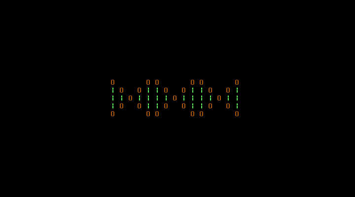

# Double Helix MBR

A bootloader that displays a double helix.

## Build

The bootloader can be built as follows:

    make

## Cleanup

Generated files can be removed as follows:

    make clean

## Test

### QEMU
To try the bootloader you can run it in QEMU:

    make test

### Bootable USB

Copy the bootloader to a block device as follows:

    dd if=double_helix.mbr of=/dev/BLOCKDEVICE bs=512 count=1
